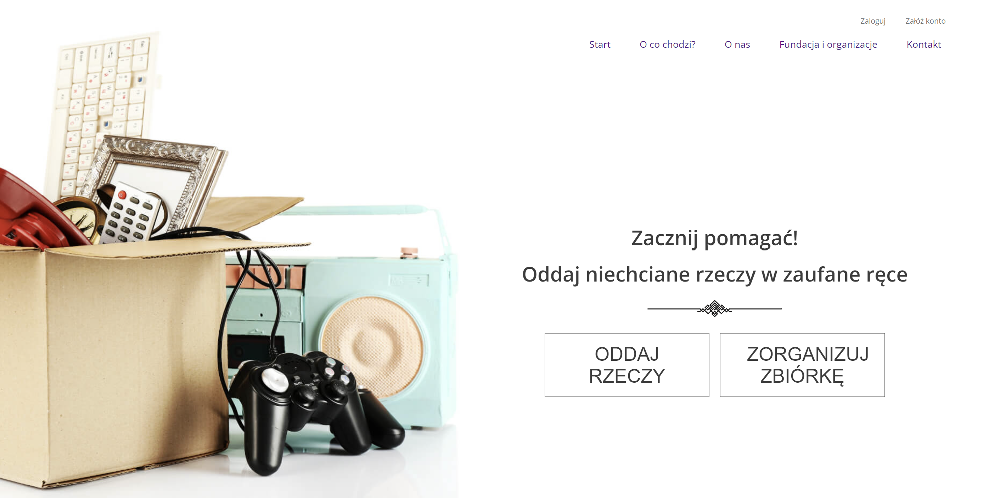

# Give and Help

## Overview

The project is a web application designed to simplify the process of donating items to those in need. It provides users with an easy-to-use form to facilitate the donation process, addressing common issues such as trust and convenience that often hinder donations.


## Features

The project was created as part of a JavaScript course and includes the following features:

1. **Home Page**: The main landing page of the application.
2. **"Komu pomagamy"/"Who do we help" Section**: This section allows users to view different groups that can receive donations. It includes pagination and navigation between groups.
3. **Contact Form**: A contact form with validation and submission functionality.
4. **User Authentication Views**:
    - Login view
    - Registration view
    - Routing between views

The project is fully responsive (RWD).

## Technologies Used

The project utilizes the following technologies:

- **JavaScript**
- **React**
- **React Scroll**
- **React Hook Form**
- **React Router**
- **CSS and SASS**
- **Firebase Authentication**
- **Firebase Firestore**

## Screenshots

Here are some screenshots of the application:

### Header


### "Komu pomagamy"/"Who do we help" Section


### Contact Form


### Login View


## Installation and Setup

To run the project locally, follow these steps:

1. Clone the repository:
   ```bash
   git clone https://github.com/AniaStep/give-and-help

2. Navigate to the project directory:
   ```bash
   cd give-and-help
3. Install the required dependencies:
   ```bash
   npm install
4. Start the development server:
   ```bash
   npm start

Once the development server is running, you can access the application in your web browser at http://localhost:3000.